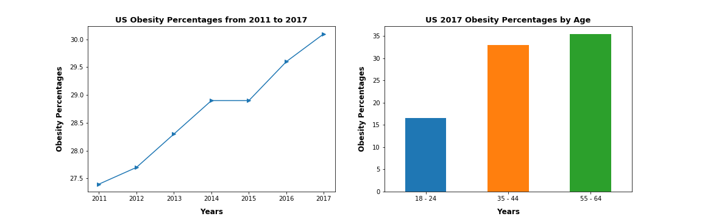
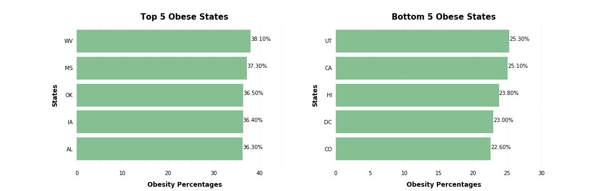
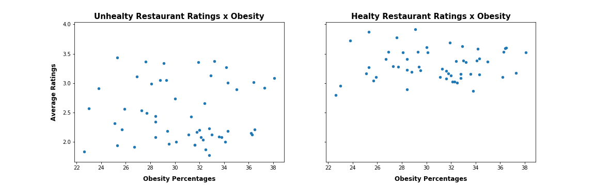
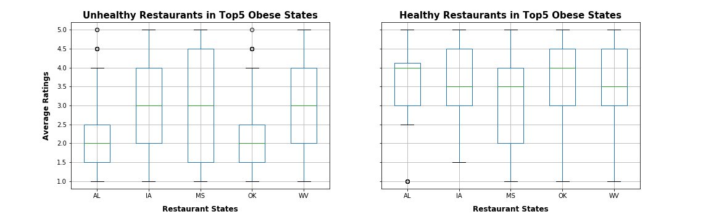
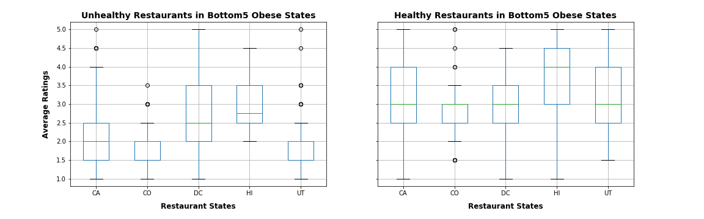
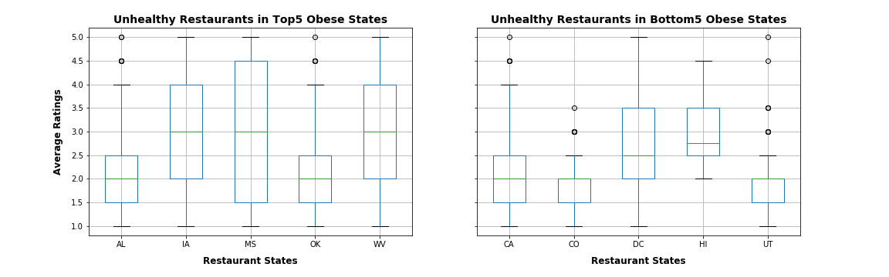
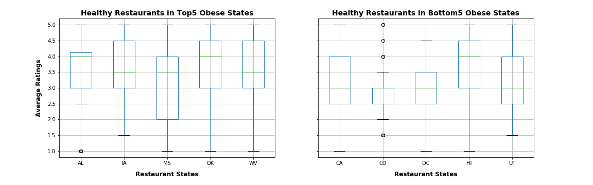

# Restaurant Ratings x US Obesity


```python
# Import Dependencies
import matplotlib.pyplot as plt
import pandas as pd
import numpy as np
import os

# Import stats for ttest analysis
import scipy.stats as stats
```


```python
# Verify library versions if some error occurs

#pd.__version__ # Pandas version: 0.23.4
#np.__version__ # Numpy version: 1.15.4
#import matplotlib as mat
#mat.__version__ # Matplotlib version: 3.0.2
```

## Obesity Data Analysis


```python
# Read in df_us csv
input_file = os.path.join('data','df_us.csv')
df_us = pd.read_csv(input_file)

# Display the Data
df_us
```


<div>
<style scoped>
    .dataframe tbody tr th:only-of-type {
        vertical-align: middle;
    }

    .dataframe tbody tr th {
        vertical-align: top;
    }

    .dataframe thead th {
        text-align: right;
    }
</style>
<table border="1" class="dataframe">
  <thead>
    <tr style="text-align: right;">
      <th></th>
      <th>Year</th>
      <th>Location</th>
      <th>Obesity Percentage</th>
    </tr>
  </thead>
  <tbody>
    <tr>
      <th>0</th>
      <td>2011</td>
      <td>US</td>
      <td>27.4</td>
    </tr>
    <tr>
      <th>1</th>
      <td>2012</td>
      <td>US</td>
      <td>27.7</td>
    </tr>
    <tr>
      <th>2</th>
      <td>2013</td>
      <td>US</td>
      <td>28.3</td>
    </tr>
    <tr>
      <th>3</th>
      <td>2014</td>
      <td>US</td>
      <td>28.9</td>
    </tr>
    <tr>
      <th>4</th>
      <td>2015</td>
      <td>US</td>
      <td>28.9</td>
    </tr>
    <tr>
      <th>5</th>
      <td>2016</td>
      <td>US</td>
      <td>29.6</td>
    </tr>
    <tr>
      <th>6</th>
      <td>2017</td>
      <td>US</td>
      <td>30.1</td>
    </tr>
  </tbody>
</table>
</div>


```python
# Read in df_ageyr_us csv
input_file = os.path.join('data','df_ageyr_us.csv')
df_ageyr_us = pd.read_csv(input_file)

# Display the Data
df_ageyr_us.head()
```


<div>
<style scoped>
    .dataframe tbody tr th:only-of-type {
        vertical-align: middle;
    }

    .dataframe tbody tr th {
        vertical-align: top;
    }

    .dataframe thead th {
        text-align: right;
    }
</style>
<table border="1" class="dataframe">
  <thead>
    <tr style="text-align: right;">
      <th></th>
      <th>Year</th>
      <th>Location</th>
      <th>Age Bin</th>
      <th>Obesity Percentage</th>
    </tr>
  </thead>
  <tbody>
    <tr>
      <th>0</th>
      <td>2017</td>
      <td>US</td>
      <td>18 - 24</td>
      <td>16.5</td>
    </tr>
    <tr>
      <th>1</th>
      <td>2017</td>
      <td>US</td>
      <td>35 - 44</td>
      <td>33.0</td>
    </tr>
    <tr>
      <th>2</th>
      <td>2017</td>
      <td>US</td>
      <td>55 - 64</td>
      <td>35.4</td>
    </tr>
  </tbody>
</table>
</div>


### Plot US Obesity Data: Overall and by Age


```python
# Create subplot figure
fig, ax = plt.subplots(1, 2, figsize = (16,5))

# Plot data for US
df_us.plot(x = "Year", y = "Obesity Percentage", ax = ax[0], marker = ">", legend = None)
df_ageyr_us.plot(kind = 'bar', x = "Age Bin", y = "Obesity Percentage", ax = ax[1], legend = None)

# Insert labels
ax[0].set_title("US Obesity Percentages from 2011 to 2017", size = 13, weight = 'bold')
ax[0].set_xlabel("Years", labelpad=10, size = 12,  weight = 'bold')
ax[0].set_ylabel("Obesity Percentages", labelpad=10, size = 12, weight = 'bold')

ax[1].set_title("US 2017 Obesity Percentages by Age", size = 13, weight = 'bold')
ax[1].set_xlabel("Years", labelpad=10, size = 12,  weight = 'bold')
ax[1].set_xticklabels(df_ageyr_us["Age Bin"], rotation = 0)
ax[1].set_ylabel("Obesity Percentages", labelpad=10, size = 12, weight = 'bold')

# Save Figures
figure_path = os.path.join('images','US_Obesity_Percentages')
plt.savefig(figure_path)

plt.show()
```





```python
# Read in df_states_2017 csv
input_file = os.path.join('data','df_states_2017.csv')
df_states_2017 = pd.read_csv(input_file)

# Display the Data
df_states_2017.head()
```


<div>
<style scoped>
    .dataframe tbody tr th:only-of-type {
        vertical-align: middle;
    }

    .dataframe tbody tr th {
        vertical-align: top;
    }

    .dataframe thead th {
        text-align: right;
    }
</style>
<table border="1" class="dataframe">
  <thead>
    <tr style="text-align: right;">
      <th></th>
      <th>Year</th>
      <th>Location</th>
      <th>Obesity Percentage</th>
    </tr>
  </thead>
  <tbody>
    <tr>
      <th>0</th>
      <td>2017</td>
      <td>WV</td>
      <td>38.1</td>
    </tr>
    <tr>
      <th>1</th>
      <td>2017</td>
      <td>MS</td>
      <td>37.3</td>
    </tr>
    <tr>
      <th>2</th>
      <td>2017</td>
      <td>OK</td>
      <td>36.5</td>
    </tr>
    <tr>
      <th>3</th>
      <td>2017</td>
      <td>IA</td>
      <td>36.4</td>
    </tr>
    <tr>
      <th>4</th>
      <td>2017</td>
      <td>AL</td>
      <td>36.3</td>
    </tr>
  </tbody>
</table>
</div>


### Plot obesity states rank: first 5 and last 5


```python
# Group dataframes
df_top5_states = df_states_2017.head().groupby('Location').sum()
df_top5_states = df_top5_states['Obesity Percentage'].sort_values()

df_bottom5_states = df_states_2017.tail().groupby('Location').sum()
df_bottom5_states = df_bottom5_states['Obesity Percentage'].sort_values()

# Create figure
fig, ax = plt.subplots(1,2, figsize= (16,5))

df_top5_states.plot(kind='barh', ax = ax[0], color='#86bf91', zorder=2, width=0.85)
df_bottom5_states.plot(kind='barh', ax = ax[1], color='#86bf91', zorder=2, width=0.85)

# Set Title
ax[0].set_title('Top 5 Obese States', weight = 'bold', size = 15, loc = 'center')
ax[1].set_title('Bottom 5 Obese States', weight = 'bold', size = 15, loc = 'center')

# Loop through subplots to put labels
for i in range(len(ax)):

    # Remove plotting borders
    ax[i].spines['right'].set_visible(False)
    ax[i].spines['top'].set_visible(False)
    ax[i].spines['left'].set_visible(False)
    ax[i].spines['bottom'].set_visible(False)

    # Switch off ticks
    ax[i].tick_params(axis="both", which="both", bottom="off", top="off", labelbottom="on", left="off", right="off", labelleft="on")

    # Draw vertical axis lines
    vals = ax[i].get_xticks()
    for tick in vals:
        ax[i].axvline(x=tick, linestyle='dashed', alpha=0.4, color='#eeeeee', zorder=1)

    # Set x-axis label
    ax[i].set_xlabel("Obesity Percentages", labelpad=10, weight='bold', size=12)

    # Set y-axis label
    ax[i].set_ylabel("States", labelpad=10, weight='bold', size=12)

# Set values on right of the bars
[ax[0].text(v, j, '{:.2f}%'.format(v)) for j, v in enumerate(df_top5_states)]
[ax[1].text(v, j, '{:.2f}%'.format(v)) for j, v in enumerate(df_bottom5_states)]
 
# Save Figures
figure_path = os.path.join('images','US_Obesity_Rankings')
plt.savefig(figure_path)
    
plt.show()
```

    /anaconda3/envs/PythonData/lib/python3.7/site-packages/matplotlib/cbook/__init__.py:424: MatplotlibDeprecationWarning: 
    Passing one of 'on', 'true', 'off', 'false' as a boolean is deprecated; use an actual boolean (True/False) instead.
      warn_deprecated("2.2", "Passing one of 'on', 'true', 'off', 'false' as a "





## Restaurant Ratings Data Analysis


```python
# Read in state_unhealthy csv
input_file = os.path.join('data','state_unhealthy.csv')
state_unhealthy = pd.read_csv(input_file)

# Display the Data
state_unhealthy.head()
```


<div>
<style scoped>
    .dataframe tbody tr th:only-of-type {
        vertical-align: middle;
    }

    .dataframe tbody tr th {
        vertical-align: top;
    }

    .dataframe thead th {
        text-align: right;
    }
</style>
<table border="1" class="dataframe">
  <thead>
    <tr style="text-align: right;">
      <th></th>
      <th>Year</th>
      <th>Location</th>
      <th>Obesity Percentage</th>
      <th>Rating Average</th>
    </tr>
  </thead>
  <tbody>
    <tr>
      <th>0</th>
      <td>2017</td>
      <td>WV</td>
      <td>38.1</td>
      <td>3.08750</td>
    </tr>
    <tr>
      <th>1</th>
      <td>2017</td>
      <td>MS</td>
      <td>37.3</td>
      <td>2.91875</td>
    </tr>
    <tr>
      <th>2</th>
      <td>2017</td>
      <td>OK</td>
      <td>36.5</td>
      <td>2.20625</td>
    </tr>
    <tr>
      <th>3</th>
      <td>2017</td>
      <td>IA</td>
      <td>36.4</td>
      <td>3.01250</td>
    </tr>
    <tr>
      <th>4</th>
      <td>2017</td>
      <td>AL</td>
      <td>36.3</td>
      <td>2.11875</td>
    </tr>
  </tbody>
</table>
</div>


```python
# Read in state_healthy csv
input_file = os.path.join('data','state_healthy.csv')
state_healthy = pd.read_csv(input_file)

# Display the Data
state_healthy.head()
```


<div>
<style scoped>
    .dataframe tbody tr th:only-of-type {
        vertical-align: middle;
    }

    .dataframe tbody tr th {
        vertical-align: top;
    }

    .dataframe thead th {
        text-align: right;
    }
</style>
<table border="1" class="dataframe">
  <thead>
    <tr style="text-align: right;">
      <th></th>
      <th>Year</th>
      <th>Location</th>
      <th>Obesity Percentage</th>
      <th>Rating Average</th>
    </tr>
  </thead>
  <tbody>
    <tr>
      <th>0</th>
      <td>2017</td>
      <td>WV</td>
      <td>38.1</td>
      <td>3.525000</td>
    </tr>
    <tr>
      <th>1</th>
      <td>2017</td>
      <td>MS</td>
      <td>37.3</td>
      <td>3.170732</td>
    </tr>
    <tr>
      <th>2</th>
      <td>2017</td>
      <td>OK</td>
      <td>36.5</td>
      <td>3.600000</td>
    </tr>
    <tr>
      <th>3</th>
      <td>2017</td>
      <td>IA</td>
      <td>36.4</td>
      <td>3.595745</td>
    </tr>
    <tr>
      <th>4</th>
      <td>2017</td>
      <td>AL</td>
      <td>36.3</td>
      <td>3.534091</td>
    </tr>
  </tbody>
</table>
</div>


```python
# Scatter plots
fig, ax = plt.subplots(1,2, figsize= (16,5), sharey = True)

state_unhealthy.plot(kind='scatter', x = 'Obesity Percentage', y = 'Rating Average', ax = ax[0])
state_healthy.plot(kind='scatter', x = 'Obesity Percentage', y = 'Rating Average', ax = ax[1])

# Set Titles
ax[0].set_title('Unhealty Restaurant Ratings x Obesity', weight = 'bold', size = 15, loc = 'center')
ax[1].set_title('Healty Restaurant Ratings x Obesity', weight = 'bold', size = 15, loc = 'center')

# Set x-axis label
ax[0].set_xlabel("Obesity Percentages", labelpad=10, weight='bold', size=12)
ax[1].set_xlabel("Obesity Percentages", labelpad=10, weight='bold', size=12)

# Set y-axis label
ax[0].set_ylabel("Average Ratings", labelpad=10, weight='bold', size=12)

# Save Figures
figure_path = os.path.join('images','US_Obesity_x_Rating')
plt.savefig(figure_path)

plt.show()
```





## State Ranking x Restaurant Ratings


```python
# Read in TOP5HEALTHY_restaurants csv
input_file = os.path.join('data','TOP5HEALTHY_restaurants.csv')
TOP5HEALTHY_restaurants = pd.read_csv(input_file)

# Display the Data
TOP5HEALTHY_restaurants.head()
```


<div>
<style scoped>
    .dataframe tbody tr th:only-of-type {
        vertical-align: middle;
    }

    .dataframe tbody tr th {
        vertical-align: top;
    }

    .dataframe thead th {
        text-align: right;
    }
</style>
<table border="1" class="dataframe">
  <thead>
    <tr style="text-align: right;">
      <th></th>
      <th>Restaurant State</th>
      <th>Restaurant Name</th>
      <th>Restaurant Rating</th>
      <th>Restaurant Review</th>
    </tr>
  </thead>
  <tbody>
    <tr>
      <th>0</th>
      <td>AL</td>
      <td>Chiptole</td>
      <td>3.0</td>
      <td>206</td>
    </tr>
    <tr>
      <th>1</th>
      <td>AL</td>
      <td>Subway</td>
      <td>4.0</td>
      <td>4</td>
    </tr>
    <tr>
      <th>2</th>
      <td>AL</td>
      <td>Subway</td>
      <td>1.0</td>
      <td>2</td>
    </tr>
    <tr>
      <th>3</th>
      <td>AL</td>
      <td>Subway</td>
      <td>2.5</td>
      <td>5</td>
    </tr>
    <tr>
      <th>4</th>
      <td>AL</td>
      <td>Subway</td>
      <td>4.0</td>
      <td>5</td>
    </tr>
  </tbody>
</table>
</div>


```python
# Read in TOP5UNHEALTHY_restaurants csv
input_file = os.path.join('data','TOP5UNHEALTHY_restaurants.csv')
TOP5UNHEALTHY_restaurants = pd.read_csv(input_file)

# Display the Data
TOP5UNHEALTHY_restaurants.head()
```


<div>
<style scoped>
    .dataframe tbody tr th:only-of-type {
        vertical-align: middle;
    }

    .dataframe tbody tr th {
        vertical-align: top;
    }

    .dataframe thead th {
        text-align: right;
    }
</style>
<table border="1" class="dataframe">
  <thead>
    <tr style="text-align: right;">
      <th></th>
      <th>Restaurant State</th>
      <th>Restaurant Name</th>
      <th>Restaurant Rating</th>
      <th>Restaurant Review</th>
    </tr>
  </thead>
  <tbody>
    <tr>
      <th>0</th>
      <td>AL</td>
      <td>McDonalds</td>
      <td>1.5</td>
      <td>8</td>
    </tr>
    <tr>
      <th>1</th>
      <td>AL</td>
      <td>McDonalds</td>
      <td>1.5</td>
      <td>29</td>
    </tr>
    <tr>
      <th>2</th>
      <td>AL</td>
      <td>McDonalds</td>
      <td>1.5</td>
      <td>31</td>
    </tr>
    <tr>
      <th>3</th>
      <td>AL</td>
      <td>McDonalds</td>
      <td>1.5</td>
      <td>19</td>
    </tr>
    <tr>
      <th>4</th>
      <td>AL</td>
      <td>McDonalds</td>
      <td>1.5</td>
      <td>18</td>
    </tr>
  </tbody>
</table>
</div>


```python
# Read in BOTTOM5HEALTHY_restaurants csv
input_file = os.path.join('data','BOTTOM5HEALTHY_restaurants.csv')
BOTTOM5HEALTHY_restaurants = pd.read_csv(input_file)

# Display the Data
BOTTOM5HEALTHY_restaurants.head()
```


<div>
<style scoped>
    .dataframe tbody tr th:only-of-type {
        vertical-align: middle;
    }

    .dataframe tbody tr th {
        vertical-align: top;
    }

    .dataframe thead th {
        text-align: right;
    }
</style>
<table border="1" class="dataframe">
  <thead>
    <tr style="text-align: right;">
      <th></th>
      <th>Restaurant State</th>
      <th>Restaurant Name</th>
      <th>Restaurant Rating</th>
      <th>Restaurant Review</th>
    </tr>
  </thead>
  <tbody>
    <tr>
      <th>0</th>
      <td>CO</td>
      <td>Chiptole</td>
      <td>3.5</td>
      <td>84</td>
    </tr>
    <tr>
      <th>1</th>
      <td>CO</td>
      <td>Chiptole</td>
      <td>3.0</td>
      <td>44</td>
    </tr>
    <tr>
      <th>2</th>
      <td>CO</td>
      <td>Chiptole</td>
      <td>3.5</td>
      <td>25</td>
    </tr>
    <tr>
      <th>3</th>
      <td>CO</td>
      <td>Chiptole</td>
      <td>3.0</td>
      <td>33</td>
    </tr>
    <tr>
      <th>4</th>
      <td>CO</td>
      <td>Chiptole</td>
      <td>3.5</td>
      <td>39</td>
    </tr>
  </tbody>
</table>
</div>


```python
# Read in BOTTOM5UNHEALTHY_restaurants csv
input_file = os.path.join('data','BOTTOM5UNHEALTHY_restaurants.csv')
BOTTOM5UNHEALTHY_restaurants = pd.read_csv(input_file)

# Display the Data
BOTTOM5UNHEALTHY_restaurants.head()
```


<div>
<style scoped>
    .dataframe tbody tr th:only-of-type {
        vertical-align: middle;
    }

    .dataframe tbody tr th {
        vertical-align: top;
    }

    .dataframe thead th {
        text-align: right;
    }
</style>
<table border="1" class="dataframe">
  <thead>
    <tr style="text-align: right;">
      <th></th>
      <th>Restaurant State</th>
      <th>Restaurant Name</th>
      <th>Restaurant Rating</th>
      <th>Restaurant Review</th>
    </tr>
  </thead>
  <tbody>
    <tr>
      <th>0</th>
      <td>CO</td>
      <td>McDonalds</td>
      <td>2.0</td>
      <td>57</td>
    </tr>
    <tr>
      <th>1</th>
      <td>CO</td>
      <td>McDonalds</td>
      <td>1.5</td>
      <td>44</td>
    </tr>
    <tr>
      <th>2</th>
      <td>CO</td>
      <td>McDonalds</td>
      <td>1.5</td>
      <td>41</td>
    </tr>
    <tr>
      <th>3</th>
      <td>CO</td>
      <td>McDonalds</td>
      <td>2.0</td>
      <td>47</td>
    </tr>
    <tr>
      <th>4</th>
      <td>CO</td>
      <td>McDonalds</td>
      <td>2.5</td>
      <td>5</td>
    </tr>
  </tbody>
</table>
</div>


### Hypothesis: In the Top5 obese states, do unhealthy restaurants have greater ratings than healthy restaurants?

### Null hypothesis: Unhealthy and healthy restaurants in Top5 obese states have the same ratings


```python
# Creat subplots
fig, ax = plt.subplots(1,2, figsize= (16,5), sharey = True)

# Create a boxplot to compare means for Unhealthy Restaurants in Top5 States
TOP5UNHEALTHY_restaurants.boxplot("Restaurant Rating", by="Restaurant State", ax = ax[0])
TOP5HEALTHY_restaurants.boxplot("Restaurant Rating", by="Restaurant State", ax = ax[1])
plt.suptitle("")

# Set Titles
ax[0].set_title('Unhealthy Restaurants in Top5 Obese States', weight = 'bold', size = 15, loc = 'center')
ax[1].set_title('Healthy Restaurants in Top5 Obese States', weight = 'bold', size = 15, loc = 'center')

# Set x-axis label
ax[0].set_xlabel("Restaurant States", labelpad=10, weight='bold', size=12)
ax[1].set_xlabel("Restaurant States", labelpad=10, weight='bold', size=12)

# Set y-axis label
ax[0].set_ylabel("Average Ratings", labelpad=10, weight='bold', size=12)

# Save Figures
figure_path = os.path.join('images','Top5_Healthy_x_Unhealthy_Boxplot')
plt.savefig(figure_path)

plt.show()
```





```python
# Test if the ratings are different
results =stats.ttest_ind(TOP5HEALTHY_restaurants["Restaurant Rating"], 
                         TOP5UNHEALTHY_restaurants["Restaurant Rating"], equal_var=False)
print(f"Statistic value: {results.statistic:.4f}")
print(f"P-value value: {results.pvalue:.16f}")
```

    Statistic value: 8.5263
    P-value value: 0.0000000000000002


### Based on the pvalue of the Ttest, we reject the null hypothesis, so Healthy and Unhealthy restaurants in Top5 Obese States have different rating averages.
### Based on the statistic value of the Ttest, we notice that Healthy restaurants have greater Ratings than Unhealthy restaurants in Top5 Obese States.
# ----------------------------------------------------------------------------------------

### Hypothesis: In the Bottom5 obese states, do healthy restaurants have greater ratings than unhealthy restaurants?

### Null hypothesis: Unhealthy and healthy restaurants in Bottom5 obese states have the same ratings


```python
# Creat subplots
fig, ax = plt.subplots(1,2, figsize= (16,5), sharey = True)

# Create a boxplot to compare means for Unhealthy Restaurants in Bottom5 States
BOTTOM5UNHEALTHY_restaurants.boxplot("Restaurant Rating", by="Restaurant State", ax = ax[0])
BOTTOM5HEALTHY_restaurants.boxplot("Restaurant Rating", by="Restaurant State", ax = ax[1])
plt.suptitle("")

# Set Titles
ax[0].set_title('Unhealthy Restaurants in Bottom5 Obese States', weight = 'bold', size = 14, loc = 'center')
ax[1].set_title('Healthy Restaurants in Bottom5 Obese States', weight = 'bold', size = 14, loc = 'center')

# Set x-axis label
ax[0].set_xlabel("Restaurant States", labelpad=10, weight='bold', size=12)
ax[1].set_xlabel("Restaurant States", labelpad=10, weight='bold', size=12)

# Set y-axis label
ax[0].set_ylabel("Average Ratings", labelpad=10, weight='bold', size=12)

# Save Figures
figure_path = os.path.join('images','Bottom5_Healthy_x_Unhealthy_Boxplot')
plt.savefig(figure_path)

plt.show()
```





```python
# Test if the ratings are different
results = stats.ttest_ind(BOTTOM5HEALTHY_restaurants["Restaurant Rating"], 
                          BOTTOM5UNHEALTHY_restaurants["Restaurant Rating"], equal_var=False)
print(f"Statistic value: {results.statistic:.4f}")
print(f"P-value value: {results.pvalue:.16f}")
```

    Statistic value: 12.7561
    P-value value: 0.0000000000000000


### Based on the pvalue of the Ttest, we reject the null hypothesis, so Healthy and Unhealthy restaurants in Bottom5 Obese States have different rating averages.
### Based on the statistic value of the Ttest, we notice that Healthy restaurants have greater Ratings than Unhealthy restaurants in Bottom5 Obese States.
# ----------------------------------------------------------------------------------------

### Hypothesis: For unhealthy restaurants, the Top5 obese states have greater ratings than the Bottom5 obese states?

### Null hypothesis: Unhealthy restaurants in Top5 and Bottom5 obese states have the same ratings


```python
# Creat subplots
fig, ax = plt.subplots(1,2, figsize= (16,5), sharey = True)

# Create a boxplot to compare means for Unhealthy Restaurants in Top5 and Bottom5 States
TOP5UNHEALTHY_restaurants.boxplot("Restaurant Rating", by="Restaurant State", ax = ax[0])
BOTTOM5UNHEALTHY_restaurants.boxplot("Restaurant Rating", by="Restaurant State", ax = ax[1])
plt.suptitle("")

# Set Titles
ax[0].set_title('Unhealthy Restaurants in Top5 Obese States', weight = 'bold', size = 14, loc = 'center')
ax[1].set_title('Unhealthy Restaurants in Bottom5 Obese States', weight = 'bold', size = 14, loc = 'center')

# Set x-axis label
ax[0].set_xlabel("Restaurant States", labelpad=10, weight='bold', size=12)
ax[1].set_xlabel("Restaurant States", labelpad=10, weight='bold', size=12)

# Set y-axis label
ax[0].set_ylabel("Average Ratings", labelpad=10, weight='bold', size=12)

# Save Figures
figure_path = os.path.join('images','Unhealthy_Top5_x_Bottom5_Boxplot')
plt.savefig(figure_path)

plt.show()
```





```python
# Test if the ratings are different
results = stats.ttest_ind(TOP5UNHEALTHY_restaurants["Restaurant Rating"], 
                          BOTTOM5UNHEALTHY_restaurants["Restaurant Rating"], equal_var=False)
print(f"Statistic value: {results.statistic:.4f}")
print(f"P-value value: {results.pvalue:.16f}")
```

    Statistic value: 4.7538
    P-value value: 0.0000024054616908


### Based on the pvalue of the Ttest, we reject the null hypothesis, so Unhealthy restaurants in Top5 and Bottom5 Obese States have different rating averages.
### Based on the statistic value of the Ttest, we notice that unhealthy restaurants have greater Ratings in Top5 obese states than in Bottom5 Obese States.
# ----------------------------------------------------------------------------------------

### Hypothesis: For healthy restaurants, the Bottom5 obese states have greater ratings than the Top5 obese states.

### Null hypothesis: Healthy restaurants in Top5 and Bottom5 obese states have the same ratings


```python
# Creat subplots
fig, ax = plt.subplots(1,2, figsize= (16,5), sharey = True)

# Create a boxplot to compare means for Healthy Restaurants in Top5 and Bottom5 States
TOP5HEALTHY_restaurants.boxplot("Restaurant Rating", by="Restaurant State", ax = ax[0])
BOTTOM5HEALTHY_restaurants.boxplot("Restaurant Rating", by="Restaurant State", ax = ax[1])
plt.suptitle("")

# Set Titles
ax[0].set_title('Healthy Restaurants in Top5 Obese States', weight = 'bold', size = 14, loc = 'center')
ax[1].set_title('Healthy Restaurants in Bottom5 Obese States', weight = 'bold', size = 14, loc = 'center')

# Set x-axis label
ax[0].set_xlabel("Restaurant States", labelpad=10, weight='bold', size=12)
ax[1].set_xlabel("Restaurant States", labelpad=10, weight='bold', size=12)

# Set y-axis label
ax[0].set_ylabel("Average Ratings", labelpad=10, weight='bold', size=12)

# Save Figures
figure_path = os.path.join('images','Healthy_Top5_x_Bottom5_Boxplot')
plt.savefig(figure_path)

plt.show()
```





```python
# Test if the ratings are different
results = stats.ttest_ind(TOP5HEALTHY_restaurants["Restaurant Rating"], 
                          BOTTOM5HEALTHY_restaurants["Restaurant Rating"], equal_var=False)
print(f"Statistic value: {results.statistic:.4f}")
print(f"P-value value: {results.pvalue:.16f}")
```

    Statistic value: 3.8043
    P-value value: 0.0001649588692480


### Based on the pvalue of the Ttest, we reject the null hypothesis, so Healthy restaurants in Top5 and Bottom5 Obese States have different rating averages.
### Based on the statistic value of the Ttest, we notice that healthy restaurants have greater Ratings in Top5 obese states than in Bottom5 Obese States.


```python

```
